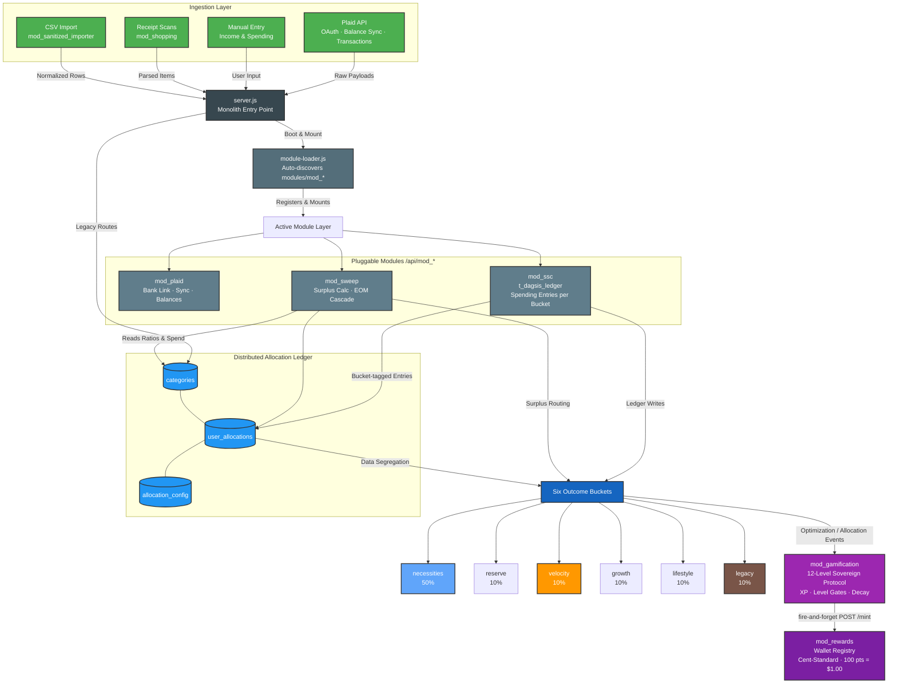

# FACTS System Architecture Map

Live visual flow of application data — from ingestion through allocation to outcome buckets and rewards.

> **Preview:** Open this file in Cursor and press `Ctrl + Shift + V` (or `Cmd + Shift + V` on Mac) for the rendered diagram.

---

## Data Flow Overview



---

## Layer Reference

| Layer | Components | Role |
|-------|------------|------|
| **Ingestion** | Plaid, Manual Entry, `mod_shopping` receipts, `mod_sanitized_importer` CSV | All financial data enters through `server.js` — no single ingestion pipe |
| **Routing** | `server.js` → `module-loader.js` | Monolith boots Express, discovers `modules/mod_*`, mounts at `/api/{moduleId}` |
| **Active Modules** | `mod_plaid`, `mod_ssc`, `mod_sweep` | Bank sync, bucket-tagged ledger entries, surplus calculation and EOM cascade |
| **Distributed Ledger** | `categories`, `user_allocations`, `allocation_config` | Allocation ratios live across DB tables and legacy routes — not a single engine class |
| **Outcome Buckets** | 6 slugs with default 50/10/10/10/10/10 split | User overrides via `user_allocations`; must always total 100% |
| **Progression** | `mod_gamification` | 12-level Sovereign Protocol; XP multipliers pause during decay state |
| **Rewards** | `mod_rewards` | Wallet Registry; integer-only Cent-Standard (100 pts = $1.00); minted via fire-and-forget POST from gamification |

---

## Bucket Slugs (Canonical)

| Slug | Default % | Purpose |
|------|-----------|---------|
| `necessities` | 50% | Housing, utilities, food, transportation |
| `reserve` | 10% | Emergency fund, strategic savings |
| `velocity` | 10% | Debt payoff, HELOC velocity engine |
| `growth` | 10% | Investments, wealth building |
| `lifestyle` | 10% | Discretionary spending, experiences |
| `legacy` | 10% | Generational wealth, future generations |

> Slug aliases in legacy code: `nec` maps to `necessities`. See `modules/mod_sweep/index.js` and `modules/mod_shopping/index.js` for runtime resolution.

---

## Rewards Chain Detail

```
Optimization / allocation event
        │
        ▼
mod_gamification  ── awardXPInternal()
  · Inserts xp_events (immutable)
  · Updates lifetime_xp + level gates
  · Decay state pauses multipliers (XP still recorded)
        │
        ▼  fire-and-forget (non-blocking)
POST /api/mod_rewards/mint
        │
        ▼
mod_rewards.user_wallet + rewards_ledger
  · Cent-Standard: 100 integer points = $1.00
  · No floats in ledger arithmetic
```

---

## Related Docs

- [`CLAUDE.md`](../CLAUDE.md) — agent context, schema tables, stack overview
- [`MODULES.md`](../MODULES.md) — full module registry
- [`HOUSEHOLD_SYSTEM_COMPLETE.md`](./HOUSEHOLD_SYSTEM_COMPLETE.md) — multi-user household feature
- [`SANDBOX_ACCOUNT.md`](./SANDBOX_ACCOUNT.md) — sandbox testing accounts
